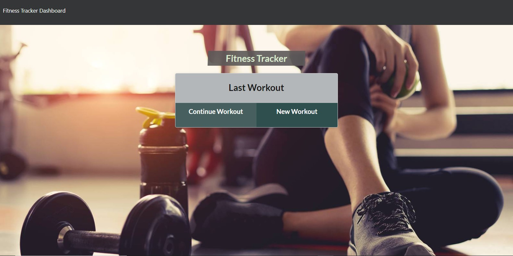
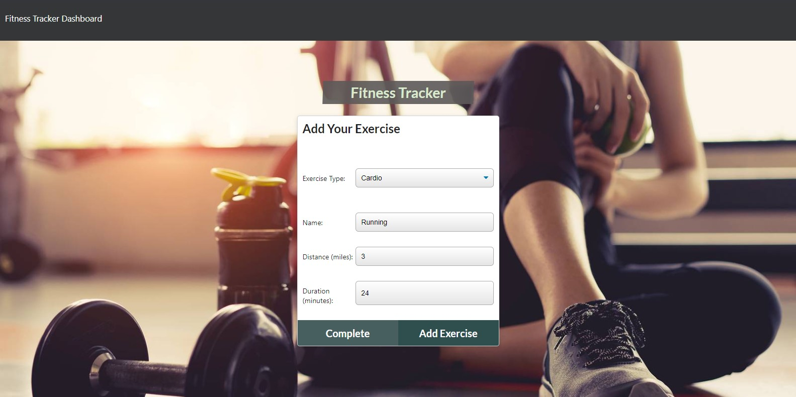

# Training Tracker

## Description
This application is designed to allow the user to log their workouts, with multiple exercises in each workout. The back end of this full stack web application uses REST APIs, MongoDB, and Mongoose to safely store and keep track of the user's data, as well as allow them to "Post," "Update," and "Get" all of their workouts.

## Table of Contents
  - [Installation](#installation)
  - [Deployment](#deployment)
  - [Usage](#usage)
  - [Technologies](#technologies)
  - [License](#license)
  - [Next Steps](#next-steps)
  - [Questions](#questions)


## Installation
``` There are no required steps to install this application as it is a live, deployed application with a URL (See Deployment). ```

## Deployment
* Deployed Application URL: https://morning-dusk-01329.herokuapp.com/

## Usage
Simply click on the link to the deployed application and start logging your workouts!





## Technologies
* HTML5 
* CSS3 
* JavaScript 
* Node JS 
* Express 
* MongoDB 
* Mongoose 
* REST APIs 
* Heroku

## License


  [MIT](https://opensource.org/licenses/MIT)
  

  

## Next Steps
* Add Delete Route 

## Questions
For additional questions please contact:
* The Privacy Dev
* Email: theprivacydev@protonmail.com
* https://github.com/theprivacydev/
